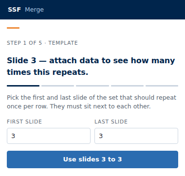
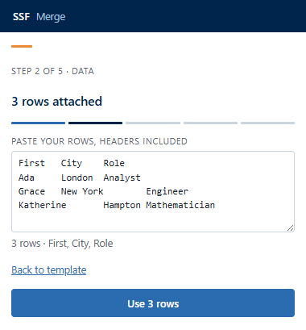
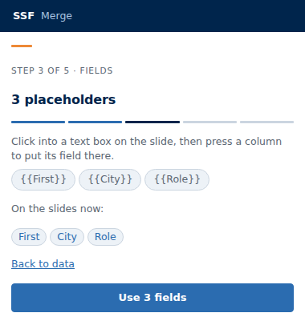
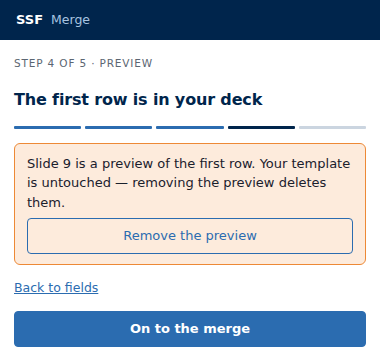
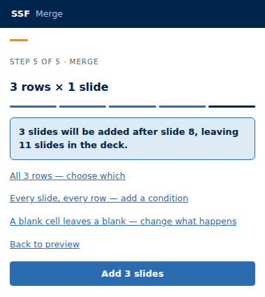
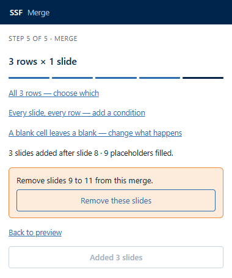
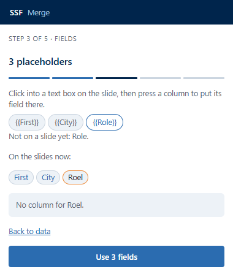
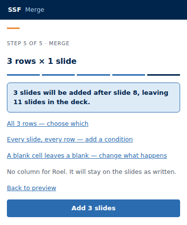

# SSF Merge — manual

Mail merge for PowerPoint. You build one slide, or one block of slides, put
placeholders where the data goes, and SSF Merge produces one copy per row.

> **Status.** Everything described here is built and shipped, with two
> exceptions, both marked where they appear: two things that could happen to
> your template after a merge, and two data sources that are not the paste box.
> Neither is on the backlog — `docs/BACKLOG.md` is empty — so read them as
> *designed and not scheduled*, not as *coming soon*.
>
> Nothing here is aspirational: a line moves out of *not scheduled* in the same
> change that makes it true. This block said the pane was not written for some
> days after it shipped, which is the failure it exists to prevent.

## Contents

**Start here**

- [Before you start](#before-you-start) — installing it, once
- [Your first merge, end to end](#your-first-merge-end-to-end) — ten minutes, with pictures
- [The idea](#the-idea)

**Building the template**

- [Placeholders](#placeholders)
- [Formats](#formats) — [numbers](#numbers), [dates](#dates)
- [Pictures](#pictures)
- [Charts and SmartArt](#charts-and-smartart)
- [What repeats](#what-repeats)

**Your data**

- [Your data](#your-data) — what the box accepts
- [What a blank cell does](#what-a-blank-cell-does)
- [Choosing which slides are conditional](#choosing-which-slides-are-conditional)
- [Choosing which rows merge](#choosing-which-rows-merge)
- [When a cell is not what its format expects](#when-a-cell-is-not-what-its-format-expects)

**Running it**

- [The pane](#the-pane) — [what a preview actually is](#what-a-preview-actually-is)
- [Where the merged slides go](#where-the-merged-slides-go)
- [What happens to the template](#what-happens-to-the-template)
- [Taking a merge back](#taking-a-merge-back)

**When it goes wrong**

- [When something goes wrong](#when-something-goes-wrong)
- [If PowerPoint takes only part of the merge](#if-powerpoint-takes-only-part-of-the-merge)
- [Limits](#limits)

**Reference**

- [Installing it](#installing-it) — [what needs re-installing](#what-needs-re-installing-and-what-does-not), [which PowerPoint](#why-it-does-not-say-which-powerpoint-it-needs)
- [Tags SSF Merge writes](#tags-ssf-merge-writes)

## Before you start

You need the add-in installed, a deck you do not mind adding slides to, and
your rows somewhere you can copy them from.

**Installing takes one file and one upload**, and you do it once — see
[Installing it](#installing-it) for the four places you can do it from. If the
**Mail merge** button is already on your Home tab, you are ready.

Nothing in this manual deletes anything. A merge only ever **adds** slides
after your template, and the last screen offers to take them straight back out.

## Your first merge, end to end

Ten minutes, start to finish, on a deck you do not mind adding slides to. Every
picture below is the real pane, and the numbers in them are this walkthrough's
numbers — a deck of **8 slides**, a template on **slide 3**, **3 rows**.

**What you will have at the end:** three new slides at the end of your deck,
one per row, each a copy of slide 3 with that row's values in it — and a button
that takes all three back out.

### The data

Copy these four lines. The columns are separated by real tab characters, which
is what you get when you copy a range out of Excel.

```
First	City	Role
Ada	London	Analyst
Grace	New York	Engineer
Katherine	Hampton	Mathematician
```

### The template slide

Pick a slide — say slide 3 — and put **three text boxes** on it, or use three
that are already there. Type something into each one: PowerPoint throws away a
text box you leave empty, so a slide of three empty boxes is a slide of
nothing, and step 3 will have nowhere to put a field.

**Do not type any `{{placeholders}}` yet.** You have not attached the data, so
you do not know what the columns are called; step 3 gives you a button per
column and types them in for you. This is the whole shape of the pane, and it
is deliberate — an earlier version asked for the placeholders first and left
first-time users guessing at names they had no way to know.

Note the slide's number in the thumbnail rail on the left. A template can be
several slides in a row; one is enough to start.

### Step 1 — Template

Open the pane: **Home** tab → **Mail merge**. Type `3` into both boxes.



The button reads **Choose the slides that repeat** until the numbers make
sense, then becomes **Use slides 3 to 3**. Press it — the pane reads that slide
out of the open deck and moves on.

### Step 2 — Data

Paste the four lines, header row included.



**Read the line under the box.** It says `3 rows · First, City, Role` — the
count *and the column names*. The column names are the half that matters: a
copy that arrives as plain text parses into one column, and a row count on its
own looks perfectly healthy when that happens.

Press **Use 3 rows**.

### Step 3 — Fields

There is now a button per column, and the pane says what to do with them:
*Click into a text box on the slide, then press a column to put its field
there.* Do that on slide 3 — `{{First}}` is typed in at the cursor — and repeat
for the other two, in whichever boxes you want them.

If PowerPoint will not type it in — usually because nothing on the slide is
selected — the pane puts the field on your clipboard instead and says so, and
you paste it yourself.

When all three are placed, press the button at the bottom. **It reads *Check
the slides for fields* until the pane knows of any, then *Use 3 fields*** —
either way, pressing it reads the slides again. It has to: there is no event
that tells a task pane you typed something on a slide, so the list is only ever
as fresh as the last read.



Under **On the slides now** is what the pane actually found. Three plain chips
means every placeholder has a column behind it. If it finds nothing at all, the
braces are probably curly quotes — retype them.

### Step 4 — Preview

Press **Preview the first row**.



Ada's row is merged and the result put at the end of your deck, as slide 9. Go
and look at it. **This is not a mock-up** — it is the ordinary merge run over
one row, so if slide 9 looks right, the other two will be right.

When you have seen enough, **On to the merge** takes those slides back out and
carries you to the last step in one press. If you would rather stay on this
step — to change a field, or go back — **Remove the preview** on the card
deletes them and leaves you where you are.

**Skip to the merge** goes on without previewing at all. It is offered until you
press Preview, after which the button above does the same job.

### Step 5 — Merge



The forecast above the button says where the slides land and how big the deck
will be afterwards, before you press anything. The button carries the count —
**Add 3 slides**, not "Merge" — so you can check it against the deck in front
of you.

The three links above it are the options you have not needed yet: which rows to
include, which slides are conditional, and what a blank cell does. Skip them
for now.

Press it.

### What you get



Slides 9, 10 and 11 are Ada, Grace and Katherine. The line above says what
happened — the count of slides *and* the count of placeholders actually filled,
which is the number worth reading. **A zero there** means the merge added the
slides and changed nothing on them, and almost always means the placeholder
names do not match the column headers.

Your template is untouched, on slide 3, exactly as you left it. Change a row
and run the whole thing again.

The card names the slides it would take — *Remove slides 9 to 11, which this
merge added* — and the button under it reads **Remove these slides**. It is
still there if you close the pane and reopen it.

### If a placeholder has no column

The commonest thing a first merge gets wrong is a spelling. `{{Roel}}` against
a column headed `Role` is reported twice, and the first time is the cheap one —
step 3 outlines the chip and names it:



If you get past that, step 5 says so again above the button:



**That is a warning, not a refusal.** The button is still live, because
sometimes a placeholder is meant to stay on the slide as written. Press on if
you meant it; go back and fix the spelling if you did not.

### Where to go next

- Values that need formatting — `{{Total|number:0}}`, `{{Signed|date:d MMM yyyy}}` — are in [Formats](#formats).
- A template of several slides is in [What repeats](#what-repeats).
- Photographs, one per row, are in [Pictures](#pictures).
- Leaving rows out, or slides out, is in [Choosing which rows merge](#choosing-which-rows-merge).

If any step does anything other than this, the pane's run record is at the
bottom of the screen once a run finishes — open **What this run did, step by
step**, select it, and copy it. It carries no cell values, only structure.

## The idea

A .pptx file is a zip of XML parts. SSF Merge does the whole merge inside that
file and hands PowerPoint the finished deck in one operation. Your formatting
survives because nothing re-authors it: each piece of text keeps the exact run
properties the designer gave it, and only the characters change.

## Placeholders

Write a field where the value should appear:

```
{{Name}}
```

Field names may contain letters, digits, underscores and dots, so `{{Customer.Name}}`
works if your columns are named that way.

**A placeholder split across formatting still works.** PowerPoint constantly
stores `{{FirstName}}` as `{{Fir` + `stName}}` after an edit or a spellcheck
pass. SSF Merge matches against the whole paragraph, not one piece at a time.

**The value takes the formatting of the run the placeholder starts in.** If you
want the merged name bold, make `{{` bold. This is the one rule worth knowing
when a merged value comes out looking wrong.

**A field with no matching column is left visible.** You will see
`{{Territory}}` on the slide rather than a blank space. A blank slide looks
finished; a visible placeholder does not, which is the point.

A field name may be written in any language — `{{Beløb}}`, `{{Größe}}`,
`{{Πλήθος}}` — and matches the column header exactly as the sheet spells it.

**Spaces are fine.** `{{Row Labels}}`, `{{Min. of cost}}` and
`{{Sum of quantity monthly}}` are all fields — which matters, because those are
the headers an Excel pivot table produces by default, and they are the
commonest thing anybody pastes in here. Space either side of the name is
ignored, so `{{ Name }}` and `{{Name}}` are the same field.

The two characters a name may **not** contain are a brace and a pipe: the pipe
starts the format, and a brace would run into the next placeholder. A name made
of nothing but spaces or punctuation is not a field either — `{{ }}` and
`{{!!}}` are just text. The Fields step will not offer a button for a column it
cannot write as a field, and says which one and why.

## Formats

Add a format after a pipe:

```
{{Revenue|number:2}}      1 234 567,89
{{Revenue|number}}        1 234 568
{{Start|date:dd MMM yyyy}} 01 Mar 2026
{{Start|date}}            01-03-2026
{{Region|upper}}          NORDICS
{{Region|lower}}          nordics
```

| Format | Argument | Notes |
| --- | --- | --- |
| `number` | decimal places, default 0 | Space for thousands, comma for decimals. Digits only — `number:1e2` is not a count and leaves the cell alone |
| `date` | a pattern, default `dd-MM-yyyy` | `yyyy` `yy` `MMMM` `MMM` `MM` `dd` `d`, and nothing else. Any other text in the pattern is printed as written |
| `upper` | none | Locale-aware, so `måned` becomes `MÅNED` |
| `lower` | none | Locale-aware |
| `image` | none | The cell names a picture file, and the shape it sits in is filled with it. Cropped to fill the shape |
| `image-fit` | none | The whole picture, letterboxed inside the shape. Nothing is cut off |
| `image-stretch` | none | The picture squashed to the shape's exact proportions. Distorts, and is there for the case where that is what you want |

**A value that does not match its format is printed unchanged.** `{{Note|number}}`
on the text "n/a" gives you "n/a", not a blank and not an error marker. The cell
is what you typed, and showing it is more useful than hiding it.

### Numbers

Both European and American forms are read. `1,5` is one and a half; `1,500` is
one thousand five hundred; `1.234,56` and `1,234.56` are the same number.

### Dates

`2026-03-01` and `3 March 2026` are read. So is `15/01/2026`, because only one
reading fits.

**`03/01/2026` is refused.** It is 3 January in Copenhagen and 1 March in
Chicago, and nothing in the cell says which. The value is printed as it stands
rather than guessed at. A deck that draws perfectly and is two months wrong is
the worse outcome. Write the date as `2026-03-01` in your source if you want it
merged as a date.

**Month names are read in English, Danish, Norwegian and Swedish**, in full or
in the three-letter form a spreadsheet writes — `3 maj 2026`, `1 okt 2026`,
`1 desember 2026`. Other languages are read where the browser happens to know
them, which is inconsistent by nature; those four are a stated list.

Until 2026-08-27 the list did not exist and every name went to the browser,
which matches an English three-letter prefix. So `marts` and `januar` worked
and `maj` and `oktober` did not — one Danish column, half of it formatted and
half of it showing the raw cell.

**The month name written OUT is English**, whatever language it was read from:
`{{Start|date:d MMM yyyy}}` gives `3 May 2026`. The output is the template
author's to choose, so write the month yourself if you want it in another
language — `{{Start|date:d}} maj {{Start|date:yyyy}}` — or use a numeric
pattern like `dd-MM-yyyy`, which reads the same everywhere.

## Pictures

A cell can name a picture file — `ada.png`, `photos\\ada.PNG` — and the field
that reads it fills a **shape** rather than writing the file name as text.

Draw a rectangle on the template where the picture belongs, put
`{{Photo|image}}` in it, and the merge fills that rectangle with the picture the
row names. Size and position are the template's: the merged deck's pictures all
sit in the same place, at the same size, on every slide, which is the whole
reason to do it this way rather than by hand.

**The `|image` is what asks for a picture.** A plain `{{Photo}}` is an ordinary
text field whose cell happens to hold a file name, so it merges to `ada.png` on
the slide. The pane offers the file picker as soon as your data has a column of
picture names — before you have written the field, because that is the order the
steps go in — so it also says, above the merge button, when you have attached
pictures that no field asks for.

**One picture per shape.** A shape has one fill, so two picture fields in the
same box cannot both be drawn. The first wins and the second keeps its
placeholder, so you can see which one was not drawn rather than wondering
where it went. Give each picture its own shape.

Anything else written in that shape stays: a caption beside the placeholder,
or another field, is untouched. Only the placeholder itself is taken away.

**Where the files come from.** Step 2 grows a picker as soon as a column looks
like it names pictures — or as soon as a slide asks for one, which is not the
same thing. A column counts as pictures only when EVERY filled cell names a
file, so one cell reading `n/a` or `TBD` makes it an ordinary text column. Write
`{{Photo|image}}` on the slide anyway and the picker appears for that column
regardless, because the field is the instruction and the type is only a guess at
it. The rows whose cell names no file keep their placeholder, as any row with a
missing picture does.

Choose the files from the folder they are in — several at
once, or the whole folder. They are read in the pane and go into the merged
deck; nothing is uploaded, and no picture is fetched from the network. A cell
holding a URL is matched by the file name at the end of it, so
`https://intranet/photos/ada.png` finds the `ada.png` you picked — and finds
nothing at all if you did not pick it.

**Matching is by file name, ignoring folders and case.** `Photos\\ada.PNG` in
the sheet finds `ada.png` from the picker. The pane says how many of the
pictures the data asks for it has in hand, and names the ones it has not — pick
those too, or leave them: a row whose picture is missing keeps its placeholder,
exactly as a text field with no column does.

**Two folders, one file name, and the pane says so.** Because matching ignores
the folders, `regions/eu/logo.png` and `regions/us/logo.png` are one name by the
time anything can act on them — and there is no way round it: a file picker
hands over the file's name and nothing else, so attaching both gives us two
files called `logo.png` and only one survives. Both rows would get the same
picture. The pane names the pair under the picker and again above the merge
button; the fix is to rename the files so they differ.

**Three fits, and the default crops.**

| Written | What you get |
| --- | --- |
| `{{Photo|image}}` | The shape filled edge to edge. The picture is centred and the overflowing edges are cut off |
| `{{Photo|image-fit}}` | The whole picture inside the shape, with empty bands on two sides |
| `{{Photo|image-stretch}}` | The picture squashed to the shape's proportions |

`image` is the one to reach for. A page of portraits at the same size reads as a
page of portraits; the same pictures letterboxed read as a page of different
sizes. Use `image-fit` for logos and product shots where cutting an edge off
loses the subject.

**PNG, JPEG, GIF and BMP.** A file of another type, or one whose bytes are not
the picture its name claims, is left out and named in the pane rather than
written into the deck. It is named when the merge FINISHES, in the sentence
that reports what the run did: nothing before that opens a file, so a `.webp`
renamed to `.png` passes the pre-merge tally and is only found on the way in.

**The merge says how many pictures it placed**, beside how many placeholders it
filled, and a zero out loud — a run that adds every slide and places no picture
otherwise reads as a success. It also names a field whose shape was already
holding another field's picture (a shape has one fill), and a picture it had to
squash because its shape takes its size from the layout and states none of its
own.

## What repeats

A template is one or more **contiguous** slides, marked as a block. Three slides
per customer is the ordinary case. Step 1 of the pane is where you name it: the
number of the first slide and the number of the last, as the thumbnail rail
counts them.

Select the slides in the thumbnail rail and press **Use the slides I have
selected**, or type the two numbers. Either way they are checked as you type.

A selection with a **gap** in it is refused rather than closed up: a template
block is slides that repeat *together*, in order, so quietly filling the gap
would add a slide to every row that you never picked. A block that ends before it starts,
a slide 0 or a fraction is **refused**, in a sentence quoting what you typed,
before a template read is spent on it.

A block running past the end of the deck is only a **warning**, and the button
stays live. The pane counts your deck when it opens and again each time you
press "Use slides N to M"; between those it can be out of date, and refusing a
block because of a count taken ten minutes ago would tell you a slide you can
see does not exist. The real check happens a moment later against the slide list
PowerPoint answers with at that instant.

- The deck's own order is the order each record gets.
- Slides must sit next to each other. Reorder them in the thumbnail pane first.
- Records are emitted whole: all of record 1's slides, then all of record 2's.
- A slide can be conditional, so a record gets two slides or three. Its position
  never changes; it is skipped in place. Set it on **step 2**, under *Every
  slide, every row* — one dropdown per slide in your block, offering the columns
  in the data you attached.
- A condition names a column. The slide is emitted when that column's cell has
  content. **A blank cell is false, and so are the words `false`, `falsk`, `no`,
  `nej`, `off` and `0`**, whatever their capitalisation. That short list exists
  because a spreadsheet boolean does not arrive as a boolean: Excel writes it
  out as a localised word, and treating `FALSK` as content would emit every
  slide it was told to leave out. Anything not on the list is content.
- A condition naming a column your data does not have **emits the slide anyway**
  and reports the problem — under the dropdowns before you merge, and in the
  sentence after it. Dropping it would hide an authoring mistake behind output
  that looks finished. You can reach this without typing a name: pick a column,
  then paste data that does not have it.
- Conditions belong to the **template**, so a new paste keeps them. They are
  keyed by slide number, so **changing the block clears them** — "slide 5 only
  when Renewal" is about the fifth slide of the deck, and a block that starts
  somewhere else would silently apply it to a different slide.
- One deck can hold several blocks over different data. Slides 4 to 6 over
  customers while slides 9 to 10 repeat over products is an ordinary report.

## Your data

*The box on step 2 is the whole of it.* This section used to promise two more
sources. One was decided against; the other was never scheduled and should not
have been listed as though it were. Both rows stay, saying what is true — a
feature a manual once promised is worth telling the reader about, and quietly
deleting the row is how a reader ends up waiting for something nobody is
building.

| Source | State |
| --- | --- |
| Paste a range copied from Excel | built — step 2 of the pane |
| Paste the text of a .csv into the same box | built — commas, quoted cells and all |
| Opening a .csv or .xlsx **file** from disk | not built, and not scheduled |
| An Excel table on OneDrive or SharePoint via Microsoft Graph | not planned |

**Opening a file.** There is no file picker for your rows, and none is planned
at the moment. The gap it would close is narrower than it sounds: the box reads
comma-separated text as readily as tab-separated, so a .csv already works if you
can get its contents onto the clipboard. What is genuinely awkward is a .csv you
have only as a file — you have to open it in something first — and a .xlsx,
which is a zip and cannot be pasted from at all without Excel.

Nothing is queued behind this. If opening a file is what stands between you and
using this add-in, that is worth saying out loud in an issue: this project's
backlog is empty, and a wall somebody actually hit is the only thing that puts
anything back on it.

**An Excel table on OneDrive or SharePoint** was the highest-priority thing on
this project's backlog and was dropped on 2026-08-30. It is not a difficulty:
Microsoft publishes no read-only permission for the Excel API, so an add-in that
only ever reads your rows would still have to ask you to let it write to all of
your files. This one makes no network calls at all, and that is worth more than
a shorter step 2. `docs/BACKLOG.md` records the reasoning in full.

Select the range in Excel, copy, and paste into the box on step 2. That arrives
tab-separated and is read as such. **Commas and semicolons are read too**, so a
CSV opened in a text editor and pasted in works either way — including the
semicolon files Excel writes on a Danish, German or French machine, where the
comma is the decimal point.

Which one it uses is worked out from the paste rather than from the header
alone: the separator is the one that splits *every* row into the same number of
cells, and into the most of them. That is what keeps `Ada;1,5` from being read
as two cells because of the decimal comma. One case stays genuinely ambiguous —
a two-column paste like `Navn;Beløb, EUR` reads consistently either way, and
nothing in the text says which — and there the comma wins.

The columns found are listed under the box beside the row count, deliberately —
a copy that came through as plain text parses into ONE column, and a row count
on its own looks perfectly healthy when that happens.

A header row with nothing under it is refused rather than counted as zero rows,
because "Add 0 slides" does not say which half was wrong.

The first row is the header. A column with no header is named `Column 3` rather
than dropped, and two columns with the same header become `Name` and `Name 2`,
because silently losing a column is worse than an ugly name. Rows that are
entirely blank are skipped.

### What a blank cell does

One cell with nothing in it is not the same as a missing column, and you can
choose what happens to it. The control is on the merge step, under the row
picker and the conditions, and it costs one line: the line says what is
currently true.

| Answer | What you get |
| --- | --- |
| **Leave the space empty** | the field disappears and the slide has a gap in it. The default, and what every merge did before this |
| **Show the field, like `{{Notes}}`** | the placeholder stays on the slide, so a reader can see the value is missing rather than guess |
| **Leave the whole row out** | that row produces no slides at all |

**Leave the whole row out counts the slides that row actually gets.** A blank
in a field that only appears on a conditional slide does not drop the row when
that row's condition already leaves the slide out — the merge and the number on
the button agree about this, and the number changes as soon as you choose it.
The heading then names both figures, "228 of 240 rows × 3 slides", and the line
above the button says how many are going and why.

**A field with no column at all is not affected by any of this.** That
placeholder always stays on the slide, whatever this control says, so an
author's typo is visible rather than hidden behind a gap — see "Placeholders".

Each column's type is detected from its values: a column is a number only if
every filled cell is one, and a date only if every filled cell is an
unambiguous date. One "n/a" makes the column text, which is the safe answer.

### Choosing which slides are conditional

On the merge screen, under the row list, is a line reading *Every slide, every
row*. Opening it shows one dropdown per slide in your block, each offering the
columns in the data you attached: leave it on **Always**, or pick **Only when
[column]**.

It sits beside the row list because the two answer the same kind of question —
which rows, and which slides — and that is what the merge screen is for.

The columns are offered rather than typed, because the engine matches a
condition against a column name exactly and a typed name that does not match is
a silent no-op you would find by counting slides in the output.

Shut, the line says how many slides are conditional, so the answer is on screen
without opening anything.

### Choosing which rows merge

Every pasted row is in by default. On the merge screen is a line saying how many
rows are in and how many are out; opening it shows a checkbox per row, labelled
with that row's first column, and a search box above them.

Search matches any cell in a row, not only the first column. It changes what the
list SHOWS, never what is ticked — so you can search for a region, untick the
three rows you do not want, clear the search, and those three stay out.

The list shows at most 60 rows at a time and says how many it did not show.
Search to reach the rest.

The merge button, the summary and the preview all count the ticked rows. Untick
everything and the button says so instead of merging nothing. Pasting new data
clears the filter, because a row number means nothing against different data.

## Where the merged slides go

**Into this deck, at the END of it.** Not directly after your template — after
the deck's last slide, wherever your template happens to sit. On an 8-slide
deck with a template on slide 3, three merged slides become slides 9, 10 and
11.

That is what ships, it is not a setting, and the merge screen says it before
you press anything: the forecast reads *"3 slides will be added after slide 8,
leaving 11 slides in the deck"*, and the number in it is the deck's size, not your
template's position.

The end of the deck is the one insertion point this add-in has tested on a real
host, and a preview lands there for the same reason. This section used to say
"after the template block", which is true only for a template that is already
last.

Two more destinations were designed and are **not being built**, decided on
2026-08-29:

- **Into a new presentation**, which would open beside the current one — better
  for large merges, because a very long deck is slow to edit.
- **One file per row**, saved to OneDrive, which is what you would attach to an
  email.

The second is blocked rather than merely unbuilt: a task pane cannot hand you a
downloaded file
([office-js#1511](https://github.com/OfficeDev/office-js/issues/1511)), so it
needs an upload-and-link route. The first is not blocked, and was declined with
the second anyway — the add-in runs in the presentation it was opened from and
cannot see a new one, so a merge sent there could never report what it produced.
Every other path in SSF Merge proves what landed by counting the deck
afterwards. `docs/BACKLOG.md` carries the full reasoning.

## What happens to the template

**Nothing. It stays exactly where it is**, which is what ships and what makes a
merge re-runnable: change a row, run it again. A merge only ever ADDS slides.

Two alternatives are designed, **not built, and not scheduled** — the backlog
that would carry them is empty. Both are one-way enough to be worth doing
carefully rather than quickly:

- **move it to the end** — out of the way, still re-runnable. PowerPoint's
  add-in API cannot hide a slide, so this is as close as it gets.
- **delete it** — ends re-run for that deck, so it would happen only after the
  merge is confirmed to have landed.

Until 2026-08-30 both of these were marked *Planned.* while nothing anywhere
was planning them. If either is what stands between you and using this add-in,
say so in an issue — that is what puts something back on the backlog.

## Tags SSF Merge writes

Merged slides carry metadata inside the file. You never need to touch it, but it
is what makes undo and re-run possible, and it is visible to any tool that reads
PowerPoint tags.

| Tag | On | Meaning |
| --- | --- | --- |
| `SSF_MERGE_RUN` | a merged slide | Which merge produced it |
| `SSF_MERGE_BLOCK` | a template or merged slide | Which template block it belongs to |
| `SSF_MERGE_SEQ` | a template or merged slide | Its position within the block |
| `SSF_MERGE_RECORD` | a merged slide | Which row it was made from |

Tags that other tools wrote are kept. SSF Merge merges its own keys into an
existing tag list rather than replacing it.

## The pane

Five steps, and the step number is shown throughout — "Step 3 of 5" states how
much is left, which is the question a first-time user actually has.

| step | what you do |
| --- | --- |
| 1 · Template | Name the first and last slide of the set that repeats. They must be next to each other. |
| 2 · Data | Paste your rows, headers included. |
| 3 · Fields | Put `{{Column}}` onto the slides, from a button per column, then read them back. |
| 4 · Preview | Merge the first row into your deck so you can look at it, then remove it. |
| 5 · Merge | Add the slides, with the count on the button, and choose which rows and which slides. |

**The data comes before the fields, and that is the whole shape of it.** A field
is a column name in double braces, so there is nothing to type until the data is
attached. An earlier version asked for the fields first and refused to go
forward without them, which meant telling a first-time user to go and type names
they had no way to know. Now step 1 takes the slide numbers alone, step 2 takes
the data, and step 3 hands you a button per column.

**The pane cannot see you typing on a slide.** There is no event for it, so the
list of fields is as old as the last read — which is why step 3's button reads
**Check the slides for fields** and pressing it looks again.

Three things about it are deliberate and worth knowing.

**Exactly one filled button per screen, always last, and it names what it does
with the number in it.** "Add 720 slides" is a statement you can check against
the deck in front of you; "Merge" is only a promise.

**Every slide is named by the number in the thumbnail rail.** Never an id — this
host refuses ids for slides a run has just added — and never a zero-based index,
which is a number you have no way to see.

**One orange thing per screen.** Normally the small tick above the heading.
Three things outrank it and take the orange for themselves, and the tick then
goes away: a **preview card**, the card offering a landed **merge back**, and
an **unmatched chip on the fields step**. Two oranges in one glance and neither
means anything.

The merge step's warning about an unmatched placeholder is deliberately *not*
orange — the tick already holds the screen's one orange there, and the warning
reads in the same muted grey as every other sentence above the button. This
paragraph claimed the opposite until 2026-08-30.

**A link back on every screen but the first.** A wizard you can only walk
forwards through is one you restart to change a number.

**One host call at a time.** While the pane is reading your slides or merging,
the button says so and nothing is pressable — including after going back a step
and forward again, which is the way a wizard usually lets you start the same
long job twice. Once a merge has added its slides the button says how many and
stays down; change the block or the data and it arms again.

All five steps are built and reachable from the screen: name the block, paste
the rows, put the fields on the slides, look at one, press the button. Pressing
"Use slides N to M" and "Check the slides for fields" both read those slides out
of the open deck, so the list is the placeholders actually found in them rather
than a guess.

### What a preview actually is

**It merges.** Pressing "Preview the first row" runs the ordinary merge over
your first row and puts the result at the end of your deck, exactly as the full
merge would. "Remove the preview" deletes those slides again.

That is the point rather than an implementation detail. What you are looking at
was produced by the code that will produce the other 239 slides, so if it looks
right, the rest will be right. A preview drawn some other way is a preview of
something nobody is going to get.

**Your template is never touched.** The obvious way to build this — write the
row's values onto your template slide and put the original text back afterwards
— would have damaged the one thing this add-in exists to protect. Setting a
shape's text through the PowerPoint API re-authors it, so the text would come
back and the formatting would not: silently, on the master copy every merged
slide is cloned from.

Two consequences worth knowing. The preview lands at the **end of the deck**,
not next to your template, because that is the one insertion point this add-in
has tested on a real host. And if you close the pane while a preview is showing,
those slides simply stay — they are ordinary slides and you can delete them.
The card names them for that reason.

The pane follows PowerPoint's theme, read once when it opens. There is no
theme-change event for a PowerPoint task pane — the one in the Office typings
belongs to Outlook — so switching PowerPoint between light and dark while the
pane is open needs the pane reopened.

## If PowerPoint takes only part of the merge

It reports in ROWS, not slides, because rows are what you pasted:

> PowerPoint took only part of the merge: 2 of 3 rows landed complete; row 3 got
> 1 of its 2 slides. Take the slides back and run it again.

That last sentence is the advice. A row with some of its slides is worse than a
row with none — it looks finished, and every row after it looks correct too, so
a short merge is easy to miss until somebody reads slide 141.

**Undo takes back everything that landed**, including the incomplete row. It
removes the slides the deck actually gained, not the number the merge was
aiming for, so there is nothing left stranded.

## Taking a merge back

After a merge lands, the pane offers **"Remove slides 13 to 732, which this
merge added"**. It names the slides rather than saying "undo", because it is
deleting part of your presentation and you should be able to check before
pressing.

It works by POSITION, not by looking the slides up: a slide a run has just
added cannot be found by id on PowerPoint for the web. The sweep is clamped so
it can never reach an index below the deck's size when the merge started, so
nothing you had before the run can be touched.

**If your deck grew after the merge, the offer goes away.** Add slides yourself,
or have a co-author add some, and the last slides in the deck are no longer the
ones the merge added — so there is no range anybody can name, and the card stops
being shown rather than naming one that would be wrong. Delete those slides by
hand. This is the safe direction: the alternative is deleting somebody else's
work.

The same applies if you take some of the merged slides out yourself: the card
then offers the ones that are left, not the number the merge originally added.

A sweep that removed only some of them keeps the offer up, because the rest are
still there and only you can finish.

**If the pane closes before you take them back, the offer comes with you.**
Reopen the add-in and it says which merge left slides in your deck and offers to
remove them, on whatever screen you land on — you do not have to walk back
through the five steps to reach the button. If the deck has grown since, the
offer is not shown, for the reason above.

**Editing after a merge does not withdraw the offer.** Untick a row, change a
condition, attach a different picture or move the template block, and the merge
button arms again — it is a different merge now. The card stays, because the
slides the last run added are still in your deck and it is the only thing that
takes them back.

## When something goes wrong

**The pane says what it is waiting on.** A merge is legitimately quiet for a
while: reading the template is allowed ninety seconds and handing the package to
PowerPoint another sixty, so up to two and a half minutes can pass with nothing
happening on screen. While it waits the pane names the call — "Waiting on
PowerPoint: inserting the merged deck…" — so you can tell a slow step from a
stuck one, and so you can say which step it stopped at.

**Every run leaves a record.** Under the outcome there is a collapsed *"What
this run did, step by step"*. Open it and you get every call the run made, in
order, with how long each took:

```
=== SSF MERGE RUN LOG ===
   0.0s  host  issued    call=counting the deck's slides budget=15000
   0.1s  host  answered  call=counting the deck's slides ms=94
   0.1s  host  issued    call=exporting the template slides budget=90000
   2.4s  host  answered  call=exporting the template slides ms=2311
   2.4s  host  issued    call=inserting the merged deck budget=60000
  14.9s  host  answered  call=inserting the merged deck ms=12470
=== END ===
```

Select it and copy it. That is the whole channel: a task pane cannot open
developer tools and cannot save a file, so the text on screen is how the record
reaches anybody. If a merge goes wrong, this is the thing worth sending.

A call that never came back shows its `issued` line with no `answered` after it,
which names the step that stopped.

**"No placeholders were filled."** The merge added the slides and changed
nothing on them, which almost always means the placeholder names in your
template do not match your column headers. Check the spelling and the braces —
`{{First name}}` matches a column headed `First name`, and nothing else does.

## Installing it

The add-in is a **manifest** — a small file naming a web page — plus the page
itself, which is hosted at
<https://ssf-merge.struktureretsundfornuft.dk>. Nothing is installed onto
your machine.

Download **`manifest-prod.xml`** from the
[latest release](https://github.com/dannbleeker/SSF-Merge/releases/latest) and
sideload it. [The file on
`main`](https://github.com/dannbleeker/SSF-Merge/raw/main/manifest-prod.xml) is
the same pointer if you would rather take it from there.

Both name the same hosted page, so the pane you get is the same either way — the
manifest is only a pointer, and it is the pointer that is versioned, not the
add-in.

| where | how |
| --- | --- |
| PowerPoint on the web | Home → Add-ins → More Add-ins → **My Add-ins** → Upload My Add-in, and pick the file |
| PowerPoint on Windows | Put the file in a folder, share the folder, then File → Options → Trust Center → Trust Center Settings → Trusted Add-in Catalogs and add the share. Restart PowerPoint; the add-in appears under **Shared Folder** |
| PowerPoint on Mac | Copy the file to `~/Library/Containers/com.microsoft.Powerpoint/Data/Documents/wef` |
| A whole tenant | An administrator deploys **`manifest-prod.json`** (the unified manifest) from the Microsoft 365 admin centre |

Then look on the **Home** tab for the **Mail merge** button.

### What needs re-installing, and what does not

Almost nothing. The pane is served from the web, so a change to the merge, the
steps, the wording or the layout reaches you the next time you open the pane —
no re-install, nothing to download.

The **manifest** is the exception. Re-sideload only when the manifest itself
changes: the ribbon button, the permissions, the display name, the icons, or
the page the button opens. Those changes are called out in the changelog.

### Why it does not say which PowerPoint it needs

The manifest declares no `<Requirements>` block, deliberately. SSF Merge needs
**PowerPointApi 1.2** — reading the deck, inserting the merged slides and taking
them back again — and that is checked when the pane opens, not declared in the
manifest.

Two things sit above that floor and are simply absent on an older PowerPoint
rather than blocking it: reading just the template slides instead of the whole
file (1.10), and the **Use the slides I have selected** shortcut (1.5). Typing
the two slide numbers works everywhere.

A declared requirement set that your PowerPoint does not meet makes the add-in
**vanish from the ribbon** with no message at all: nothing to see, nothing to
report, nothing to search for. The runtime check can tell you which version is
missing and what it costs you, which is worth more than a silent absence.

**The cost of that choice, stated plainly.** Because the manifest declares
nothing, Microsoft's own validator reports the add-in as installable on every
PowerPoint back to **2013 on Windows** — and PowerPoint 2013 does not have
PowerPointApi 1.2. So on an old enough PowerPoint the add-in installs, appears
on the Home tab, opens, and then tells you it cannot run and why. That is the
trade: a message you can read and act on, instead of a button that was never
there.

## When a cell is not what its format expects

The rule throughout is that a cell the engine cannot read is **printed as it
stands**, never guessed at and never blanked. A merged deck that draws perfectly
and is two months wrong is worse than one showing the cell untouched, because
nobody checks the first one.

So: an impossible date is left alone rather than rolled forward into the real
date that follows it, in **every spelling** it can be written in —
`29/02/2025`, `2026-02-29`, `31 Feb 2026`, `31/04/2026`, `2026-04-31`. An
ambiguous slash date like `03/01/2026` is left alone for the same reason. A
`number:` format asking for impossible decimals leaves the cell alone rather
than failing the merge.

Until 2026-08-27 this paragraph was true of the slash spellings and false of the
other two: `2026-02-29` merged as 1 March and `31 Feb 2026` as 3 March, on every
slide, with nothing said. A real leap day — `2024-02-29` — is still a date.

Dates are read and written in the same zone, so `1 Mar 2026` prints as
`01 Mar 2026` wherever you are.

## Charts and SmartArt

Placeholders inside a chart or a SmartArt graphic are merged like any other.
Put `{{Region}}` in a chart's title, in its category labels, or in a SmartArt
box, and each merged slide gets that row's value.

Every copy gets a chart of its own, so the slides differ — which is the whole
point, and is why a merged deck with charts is bigger than one without.

**Modern chart types work too** — waterfall, funnel, treemap, sunburst,
histogram, pareto, box and whisker, region map. PowerPoint stores those as a
different kind of part from a bar or a line chart, and both kinds are merged the
same way: put `{{Region}}` in the title, in the category labels or in the series
name and each copy gets its row's value, in the chart and in the workbook
behind it.

There is one thing to know about them, and it only affects old versions.
PowerPoint 2013 and earlier cannot draw a modern chart at all, so the file
carries a picture of it for them to show instead — and a picture cannot be
merged. Rather than send every recipient a picture of the TEMPLATE's numbers,
each merged copy replaces it with a short notice saying the chart needs a newer
PowerPoint. Anything from 2016 onwards, and the web, draw the real chart and
never see the notice.

**What is merged**: the chart title, axis titles, data labels, the category and
series NAMES, and every SmartArt box. The workbook behind the chart is merged
too, so the labels are still right if you click Edit Data on a merged slide.

**The numbers too, from the chart's own data sheet — in a modern chart as well
as an ordinary one.** Right-click the chart, press **Edit Data**, and type
`{{Revenue}}` into a value cell the way you would type a number. Each merged copy then gets that row's figure, written both into
the sheet and into the chart itself — so the bars differ per recipient, and Edit
Data still agrees with what is drawn.

There is no separate syntax for it: a value cell holds the same `{{Column}}` as
anything else. Two things are worth knowing.

- **A format is ignored in a value cell.** `{{Revenue|number:0}}` in a title
  reads `1 250 000`; in a value cell that string plots nothing, so the raw
  number goes in and the chart formats its own axis.
- **A value that will not be a number is left alone.** `{{Notes}}` in a value
  cell stays exactly as you typed it rather than becoming a zero, because a zero
  is a bar the data never asked for. The merge counts those and says so when it
  finishes — this is the one failure you cannot see on the slide, because the
  point keeps the template's number under a label that merged correctly.

While you are still editing the template that cell holds text, so its bar shows
as nothing until you merge. That is the same as a slide reading `{{Name}}` until
you merge, and it is not a sign anything is wrong.

**Type the placeholder where the text is**, not where it is displayed. In a
chart, click the title or the category axis and type there — or type it into the
chart's data sheet for a category name, which is the same string and merges the
same way. In SmartArt, use the text pane.

**If the chart's own data cannot be opened** — an embedded object another tool
wrote — the slides are still merged and still read correctly, and the pane says
so once. Only the chart's Edit Data will still show your placeholders.

## Limits

- **On PowerPoint 2013 and earlier, a merged modern chart shows a notice
  instead.** See "Modern charts" above: those versions cannot draw one at all,
  and what they fall back to is a picture this add-in cannot redraw for each
  row. Anything newer shows the chart itself.
- **Cut and paste on PowerPoint for the web loses shape tags**
  ([office-js#3784](https://github.com/OfficeDev/office-js/issues/3784)). A
  merged slide cut and pasted into another deck loses its run tag, so undo will
  no longer find it.
- **A very long deck is slow to edit**, which is PowerPoint's behaviour and not
  something an add-in can fix. Merging into a separate presentation avoids it.
